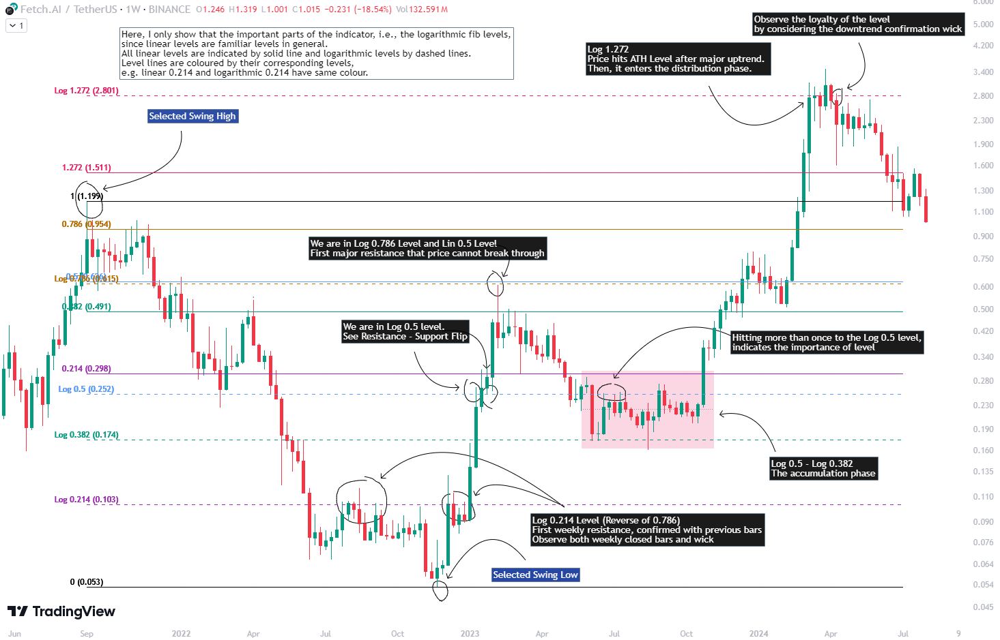

# Introduction

The Fibonacci Retracement tool is a technical analysis instrument used by traders to identify potential support and resistance levels. The principle behind determining these levels involves measuring the distance between selected reference high and low points (commonly referred to as swing high and swing low) as one unit and marking the ratios derived from the Fibonacci sequence, such as 0.236, 0.382, 0.618, etc., over this unit.

In the conventional method of level determination, the unit is divided into equal segments, and Fibonacci levels are established based on these equal divisions. These levels are referred to as **Linear Levels**. A relatively less common method involves dividing the unit into proportionally equal distances to determine Fibonacci levels, which are known as **Logarithmic Levels**.

The purpose of this indicator is to facilitate the determination of both Linear and Logarithmic levels.

# Applications

**Logarithmic Levels** can be utilized in any market instrument where volatility is high. In the cryptocurrency market, Logarithmic Levels perform particularly well for $BTC (to observe this, study for the wick from January 23, 2024).

Additionally, Logarithmic Levels can be used to identify potential accumulation and distribution patterns in altcoins with relatively high volume and market capitalization (e.g., $FETUSDT). In traditional markets, these levels can be useful for analyzing stocks with highly inflated or deflated prices (e.g., $TSLA, $NVDA), stocks in markets of countries experiencing high inflation (e.g., $XU100), or currency pairs of countries undergoing a recession (e.g., $JPYUSD).

# Usage

The indicator is designed similarly to the Fibonacci Tool provided by TradingView, ensuring familiarity for users. Upon starting the indicator, select the reference levels (Level 1 and Level 0), then access the indicator settings to choose specific levels and customize them according to your preferences.

# Unique Features

In the Fibonacci Tool provided by TradingView, both linear and logarithmic levels are visible. However, viewing logarithmic levels requires switching the relevant instrument's Super Chart to a logarithmic scale. This can lead to errors such that false behaviour in indicators, incorrect functioning of trend lines drawn in linear scaling, disabling the ability to set alerts for prices and trend lines, etc.

This indicator was created to avoid these issues without needing to change the chart's scaling method, and allowing simultaneous viewing of both linear and logarithmic levels.

# Version Control

- The indicator is currently in the beta phase. Please report any bugs you encounter.

## Version 1.0.0

### Bugs

- _(Solved)_ The prices related to the Fibonacci levels calculated by the indicator may differ from the prices calculated by the Fibonacci tool provided by TradingView. However, this difference only occurs in the last decimal place. For example, 1.9764 may be rounded to 1.9765.
    - The Fibonacci tool provided by TradingView uses the `ceiling` function when calculating prices for the relevant levels, rounding up to the next significant decimal place. Our indicator, however, employs more precise and accurate rounding.
- _(Unresolved)_ When the `endTime` parameter is manually increased from the indicator's settings to select a specific future date, the `Extend Left` option is automatically activated.
- _(Unresolved)_ When the `endTime` parameter is manually increased to a future date beyond the current date, the horizontal level lines start from the `startTime` bar and extend infinitely to the left.
- _(Unresolved)_ Optimization and cleaner scripting are needed to ensure that the indicator does not cause any runtime errors, particularly if new features are desired to be added.

### Upcoming Features

- _(Not Added)_ Add a `noise` option. This option would create new levels by adding and subtracting a user-determined margin of error to the prices corresponding to the Fibonacci levels. In scenarios where prices do not exactly touch the levels, this function provides traders with more flexibility and faster usage. However, script optimization is necessary to ensure that the `noise` function does not cause runtime errors.
- _(Not Added)_ When `Labels Left` and `Extend Left` are enabled, display price labels at the left edge of the chart.
